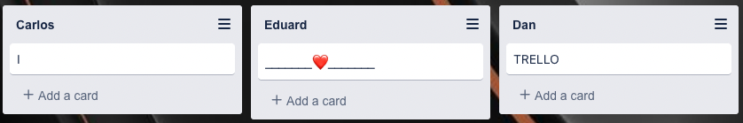

# Trello Front-end Client Recreation

This is a project done with [@eduardpeters](https://github.com/eduardpeters) and [@carlosisen](https://github.com/carlosisen) for [The Bridge](https://www.thebridge.tech/).

[Click here to try it out!👾](https://trello-client-project.vercel.app/)

## Overview

This was our first serious React project 😎
The task was to create a front-end MVP with Trello's basic features, making use of their open API to handle the back-end.

### Challenges

Pretty much everything appart from basic state management was new to us so it was all a challange!
But we knew that to make it work we needed a couple of basic ideas to work:

- Make auth as straight-forward as possible
- Display user boards and load content
- Perform CRUD operations with lists, cards, comments, checklists, etc
- Make it look pretty 💋

### How did it feel then

First, a big accomplishment. It is always beautiful to MAKE something.

There was a lot of going back and forth since we had to figure out the architecture on the fly as we had never worked with that amount of data (and dynamic as it is). First figuring out our first big boys API. Then, where and when to call it. Only to realize we NEEDED context and migrating all the data there. Then trying to keep re-renders at a minimum. Implementing "react-dnd" and trying not to break everything😅

### How it feels now

There was quite a bit of state management if we had more time I think we could have looked into Redux and try to optimize there. We left out SO MUCH of what the API allows you to do and I would have loved to continue working on it, but it was time to move on and let our baby go.
At the end of the day, it was an awesome project and we all improved our front-end skills 500%.

